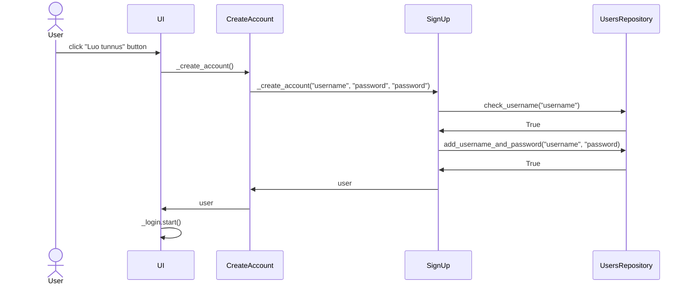

## Toiminnallisuudet sekvenssikaavioina

### Käyttäjätunnuksen luominen:

```mermaid
sequenceDiagram
   actor User
   participant UI
   participant CreateAccount
   participant SignUp
   participant UsersRepository
   User->>UI: click "Luo tunnus" button
   UI->>CreateAccount: _create_account()
   CreateAccount->>SignUp: _create_account("username", "password", "password")
   SignUp->>UsersRepository: check_username("username")
   UsersRepository->>SignUp: True
   SignUp->>UsersRepository: add_username_and_password("username", "password)
   UsersRepository->>SignUp: True
   SignUp->>CreateAccount: user
   CreateAccount->>UI: user
   UI->>UI: _login.start()

```

