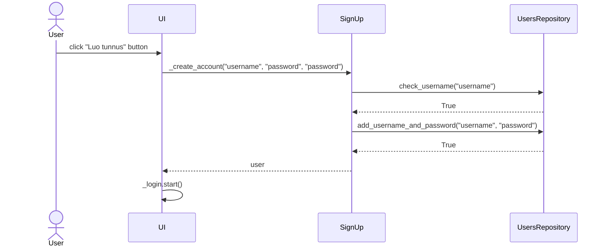

## Toiminnallisuudet sekvenssikaavioina

### Käyttäjätunnuksen luominen:

Sekvenssikaavion selitys:

Käyttäjä on sisäänkirjautumisnäkymässä, kirjoittaa käyttäjätunnuksen ja salasanan (kahdesti) ja klikkaa "Luo tunnus" -painiketta. Kutsutaan käyttöliittymän luokassa CreateAccount olevaa metodia _create_account. Tämä metodi taas kutsuu sovelluslogiikan SignUp-luokassa olevaa metodia _create_account, jolle annetaan parametrina käyttäjän syöttämä tunnus ja salasanat. Käyttätunnusten ja salasanojen tallentamisesta vastaava luokka UsersRepository sisältää metodin check_username("username"), jolla tarkistetaan, onko käyttäjätunnus uniikki. Mikäli näin on, metodi palauttaa True. Tämän jälkeen käyttäjätunnus ja salasana lisätään tietokantaan käyttämällä UsersRepository-luokan metodia add_username_and_password("username", "password"). Sovellus siirtyy sisäänkirjautumisnäkymään.
