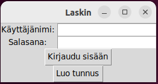
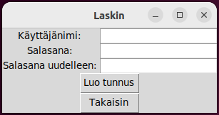
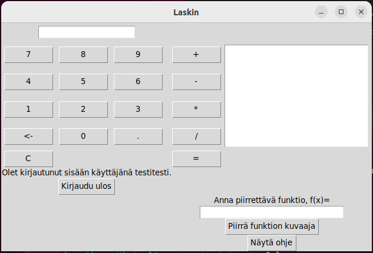

# Käyttöohje

Sovelluksen koodi löytyy [releaseista](https://github.com/isagimos/laskin/releases). Uusin versio on merkitty Latest-merkinnällä. Sen saa ladattua klikkaamalla Source code (zip).

## Lataamisen jälkeen tee seuraavat toimenpiteet:

Asenna riippuvuudet:

```bash
poetry install
```
Käynnistä sovellus seuraavalla komennolla:

```bash
poetry run invoke start
```

# Sovelluksen käyttäminen

## Sovelluksen aloitusnäkymä:



Aloitusnäkymässä voi kirjautua sisään tai luoda tunnuksen.

## Tunnuksen luonti -näkymä:



Käyttäjätunnuksen on oltava vähintään 3 merkkiä ja salasanan 8 merkkiä pitkä. Onnistuneen tunnuksen luonnin jälkeen sovellus siirtyy takaisin aloitusnäkymään. Sisäänkirjautuminen siirtää käyttäjän laskinnäkymään.

## Laskinnäkymä:



Laskinnäkymässä voi hyödyntää laskimen toiminnallisuuksia laskemalla laskuja, selaamalla laskimen käytön historiaa ja piirtämällä funktion graafisen esityksen. Ohje funktion piirtämiseen avautuu klikkaamalla painiketta "Näytä ohje".
