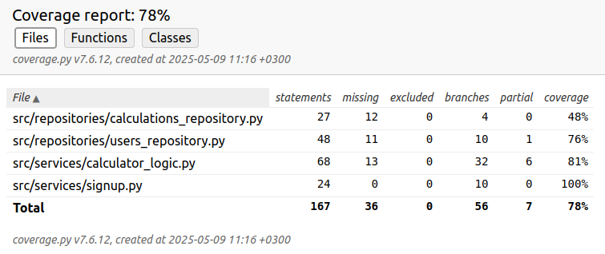

# Testausdokumentti

HTML-muotoinen testikattavuusraportti luodaan seuraavalla komennolla:
```bash
poetry run invoke coverage-report
```

Kuvakaappaus raportista:



Testeillä testataan sovelluksen repositories- ja services-hakemistojen luokkia. Käyttöliittymään liittyvät luokat jäävät testien ulkopuolelle.

Raportista nähdään, että testikattavuus on yhteensä 78 %. Paras testikattavuus, 100 %, on services-hakemiston luokassa SignUp. Alhaisin kattavuus, 48 %, on repositories-hakemiston luokassa CalculationsRepository.

# Testien erittely

## Sovelluksen toimintalogiikka (backend)

Tätä testataan luokalla [TestCalculator](https://github.com/isagimos/laskin/blob/master/src/tests/calculator_logic_test.py). Tavoitteena on mahdollisimman kattavasti testata, miten erilaiset syötteet käyttäytyvät ja saadaanko niillä odotettu palautusarvo.

## Repositorion sisältämät luokat

Testataan luokalla [TestLogin](https://github.com/isagimos/laskin/blob/master/src/tests/login_test.py). Testi yrittää luoda käyttäjätunnuksen tunnuksella username_test.

## Services- ja repositories-hakemistoja testaava testi

[TestSignup](https://github.com/isagimos/laskin/blob/master/src/tests/signup_test.py)-luokka testaa sekä käyttäjätunnuksen luomisesta vastaavaa SignUp-luokkaa että repositoriota, joka vastaa käyttäjien tallennuksesta tiedostoon. Testit luovat testikäyttäjätunnuksen ja testaavat, alauttaako metodi False. Tämän jälkeen luotu testikäyttäjä poistetaan tiedostosta users.csv, jotta testien suorittaminen ei aiheuta mitään pysyvää muutosta tiedostoon.
